# AnalysisLoom 🔬

[](https://github.com/YSF-Studio/analysisloom/actions/workflows/build.yml)
[](https://github.com/YSF-Studio/analysisloom/actions/workflows/audit.yml)
[](LICENSE)


> Forensic analysis workstation — NTFS/MFT parsing, file carving, SQLite inspection, encryption detection, timeline reconstruction & case management. Built with **Tauri v2 + Rust + SvelteKit**. **100% offline** — all processing runs locally.

<p align="center">
  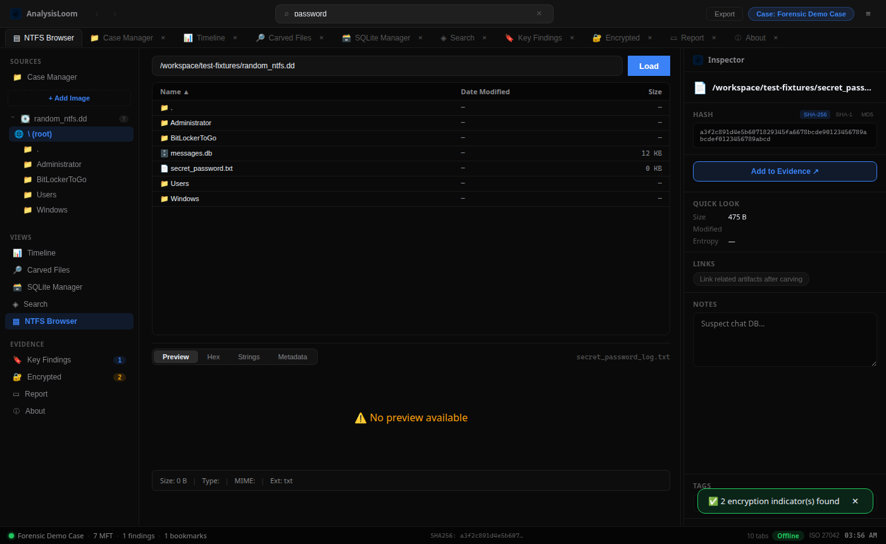
</p>

## ✨ Features

| Module | Status | Description |
|--------|--------|-------------|
| **Case Manager** | ✅ Ready | Create cases, assign operator, track evidence per investigation |
| **NTFS Browser** | ✅ Ready | Parse MFT from disk images (`.dd`, `.raw`, `.img`), browse folder tree, filter by parent record |
| **Inspector** | ✅ Ready | SHA-256 / SHA-1 / MD5 hashing, file preview, add to evidence chain |
| **Timeline** | ✅ Ready | Chronological event log from MFT loads, encryption scans, and manual entries |
| **File Carving** | ✅ Ready | Signature-based recovery (JPEG, PNG, PDF, ZIP, SQLite, ELF, …) with progress tracking |
| **SQLite Manager** | ✅ Ready | Browse tables, columns, paginated rows, custom `SELECT` queries |
| **Keyword Search** | ✅ Ready | Search evidence notes and findings within the active case |
| **Key Findings** | ✅ Ready | Bookmarks with tags and notes on files of interest |
| **Encrypted Volumes** | ✅ Ready | Detect LUKS, BitLocker indicators, and high-entropy regions |
| **Report** | ✅ Ready | Export HTML & PDF case reports with audit trail |
| **About** | ✅ Ready | Version info, feature list, offline/privacy statement |
| **Registry Analyzer** | ✅ V1.5 | SAM/SYSTEM/SOFTWARE/NTUSER.DAT — USB history, UserAssist, Shellbags, MRU, Run keys |
| **YARA Scanner** | ✅ V1.5 | Built-in malware rules + custom `.yar` loading, scan case evidence |
| **Anti-Forensics** | ✅ V1.5 | Timestomp, extension mismatch, NTFS ADS, zero-size anomalies, deleted MFT flags |
| **Browser Artifacts** | ✅ V1.5 | Chrome/Firefox/Safari/Edge history, downloads from SQLite databases |
| **NSRL Lookup** | ✅ V1.5 | NIST hash set import & known-good filtering |
| **Memory Bridge** | ✅ V1.5 | Import Volatility 3 JSON — processes & network connections |
| **Hex Search** | ✅ V1.5 | Byte pattern search (`hex:FF D8 FF`) across evidence files |
| **Windows EVTX Parser** | ✅ V2 | Security event log — 4624/4625 logon, 4688 process, 4104 PowerShell, 7045 service |
| **macOS Artifact Analyzer** | ✅ V2 | KnowledgeC.db, Unified Log (.logarchive), plist, Spotlight, DataDetectors, TCC |
| **PCAP Network Analyzer** | ✅ V2 | TCP/UDP/DNS/HTTP flow reconstruction from packet captures |
| **Evidence Bundle Export** | ✅ V2 | ZIP package — evidence files + SHA-256 manifest + HTML/PDF report |
| **Super Timeline** | ✅ V2 | Multi-source correlated timeline (NTFS, registry, browser, YARA, memory, EVTX, PCAP) |
| **Deleted Recovery** | ✅ V2 | Recover deleted files from NTFS browser via integrated carving |
| **Theme Toggle** | ✅ V2 | Light / dark mode (☀/☾ in titlebar) |
| **Drag & Drop** | ✅ V2 | Drop evidence files onto workspace — auto-hash in Inspector |
| **Prefetch + Jump Lists + LNK parser** | ✅ V2.1 | Windows execution traces — SCCA prefetch, shell links, Jump Lists |
| **Steganography detection** | ✅ V2.1 | LSB ratio, χ² analysis, metadata anomaly scan on images |
| **Email forensics (PST/OST)** | ✅ V2.1 | Mailbox header parsing, folder discovery, message stub extraction |
| **Chat artifacts** | ✅ V2.1 | WhatsApp, Telegram, Signal SQLite message databases |
| **Linux auditd + bash history** | ✅ V2.1 | auth.log, audit.log, .bash_history endpoint activity |
| **Plugin SDK** | ✅ V2.1 | Rust `ForensicPlugin` trait — hash, entropy, strings built-ins |
| **Timeline visualization** | ✅ V2.1 | Gantt-style multi-source timeline with source-colored bars |

### Architecture

```
┌─────────────────────────────────────────────────────────────┐
│  Titlebar — search, case pill, export                       │
├──────────┬──────────────────────────────┬───────────────────┤
│ Sidebar  │  Main view (tabbed)          │  Inspector        │
│ Sources  │  NTFS / SQLite / Carving …   │  Hash + Evidence  │
│ Views    │                              │                   │
│ Evidence │                              │                   │
├──────────┴──────────────────────────────┴───────────────────┤
│  Status bar — case stats, file count, audit shortcut        │
└─────────────────────────────────────────────────────────────┘
```

All forensic engines run **inline in Rust** (no external CLI dependencies).

## 🖥️ Screenshots

### Case Manager
Create and switch between forensic cases. Each case isolates evidence, timeline, bookmarks, and audit log.

| |
|:--:|
| 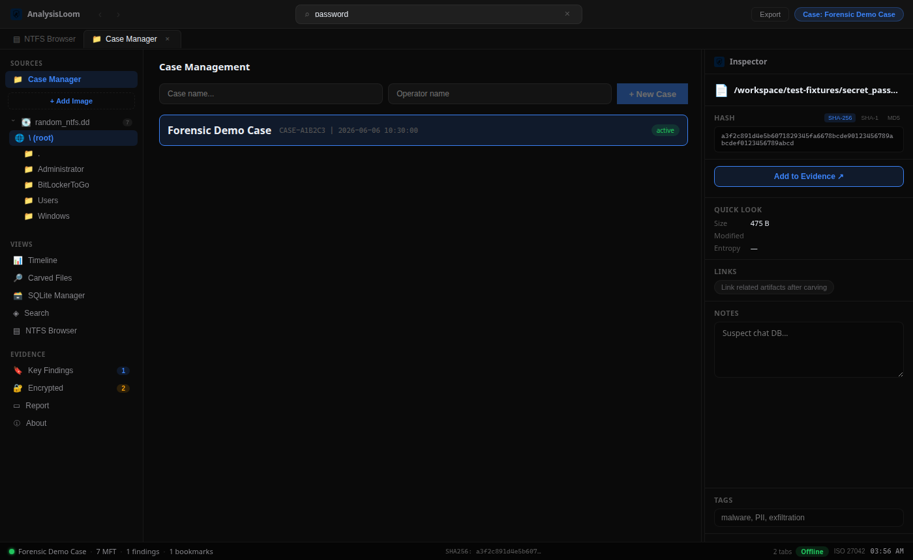 |

### NTFS Browser
Load a disk image, parse the Master File Table, and browse the reconstructed directory tree. Deleted entries are flagged.

| |
|:--:|
| 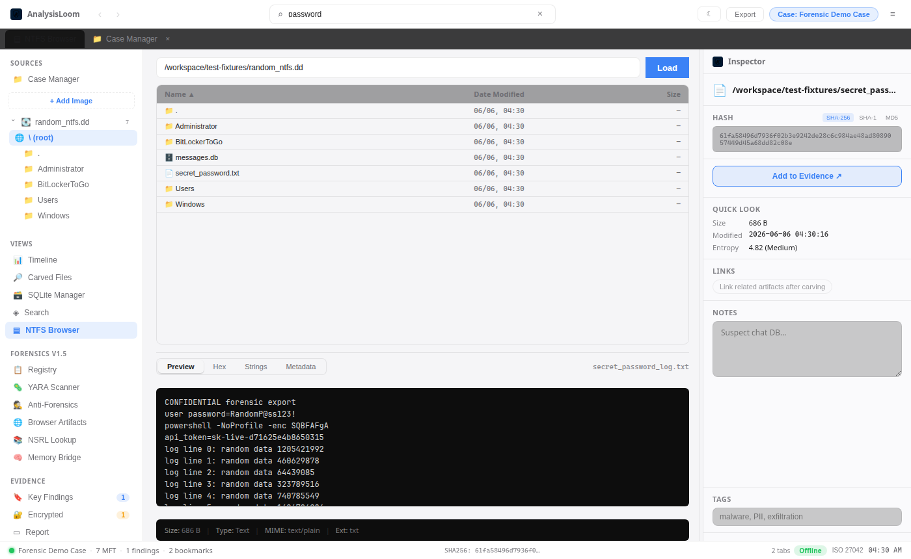 |

**How to use:** Sidebar → **Add Image** → select `.dd` / `.raw` / `.img` → browse files in the main pane. Click a row to inspect hashes in the right panel.

### Inspector
Real-time hashing from the Rust backend. Add artifacts to the evidence chain with tags and notes.

The Inspector pane is visible on the right in the NTFS Browser screenshot above. Select any file or open an artifact via **Open Artifact** to populate hashes and preview metadata.

### Timeline
Reconstruct investigation chronology from automated and manual events.

| |
|:--:|
| 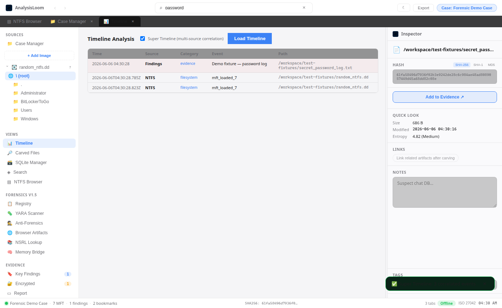 |

### File Carving
Scan raw images for embedded file signatures. Supports async carving with cancel and progress.

| |
|:--:|
| 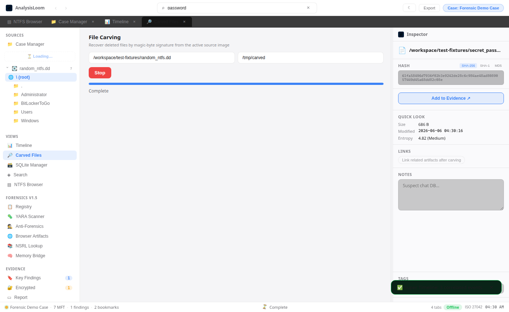 |

**How to use:** Load a disk image in Sources → open **Carved Files** → set output directory → **Start Carving**.

### SQLite Manager
Inspect SQLite databases found on disk or opened as standalone artifacts.

| |
|:--:|
| 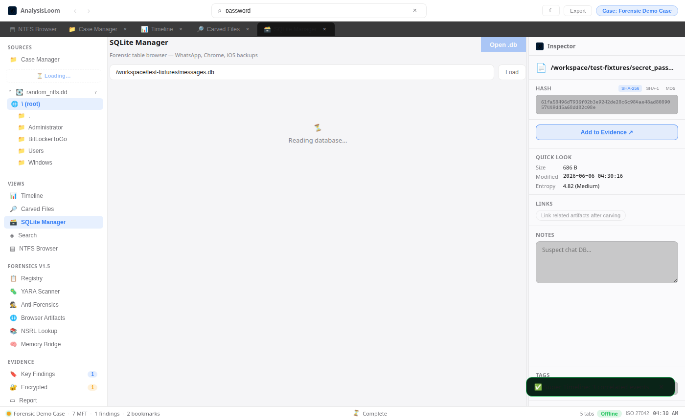 |

**How to use:** Open a `.db` file via **Open Artifact**, or click a `.db` entry in the NTFS browser.

### Keyword Search
Search across evidence and findings in the active case.

| |
|:--:|
| 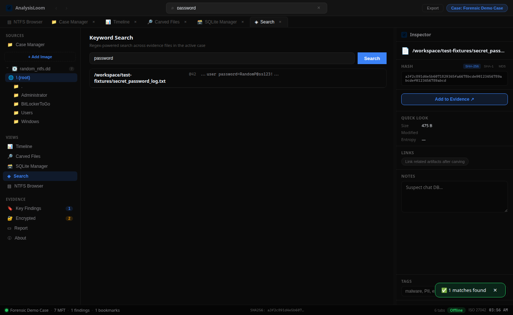 |

### Key Findings (Bookmarks)
Tag and annotate files of interest with severity-colored bookmarks.

| |
|:--:|
| 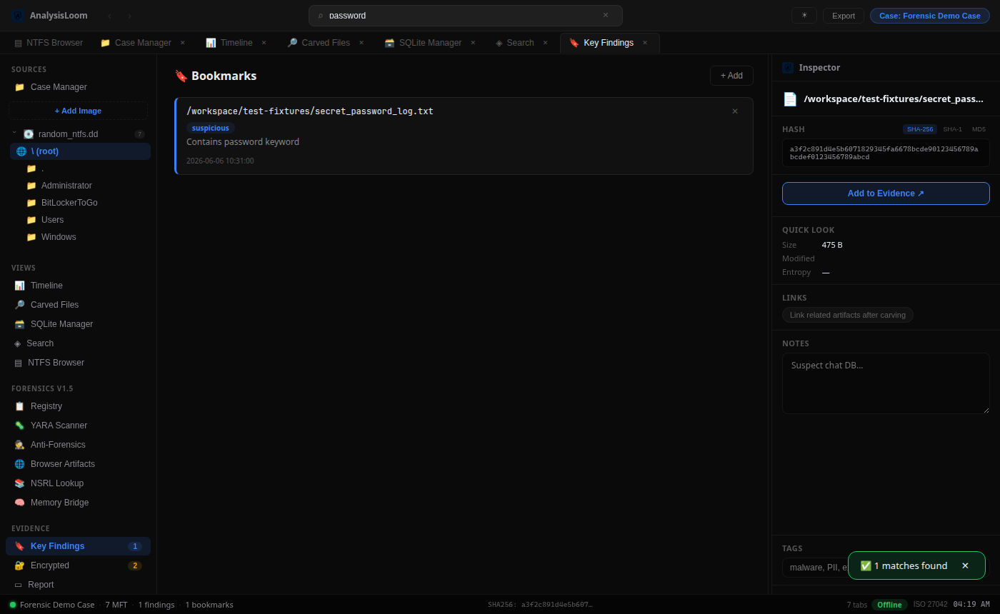 |

### Encrypted Volumes
Scan disk images for LUKS headers, BitLocker markers, and high-entropy encrypted regions.

| |
|:--:|
| 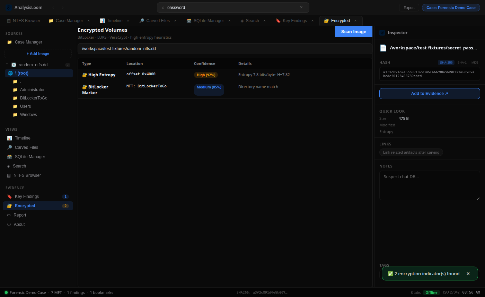 |

**How to use:** Load a disk image → open **Encrypted** → **Scan for Encryption**.

### Registry Analyzer
Parse Windows registry hives (SAM, SYSTEM, SOFTWARE, NTUSER.DAT) and surface USB history, UserAssist, MRU, and other forensic keys.

| |
|:--:|
| 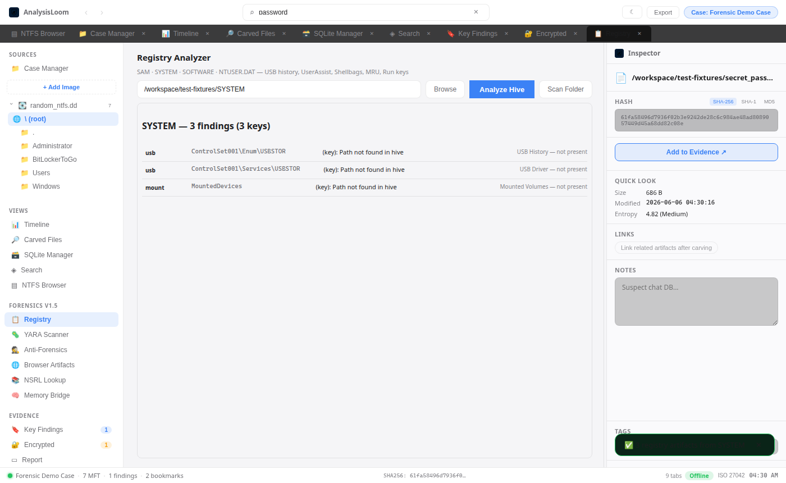 |

**How to use:** Open **Registry** → point to a hive file or directory → **Analyze Hive**.

### YARA Scanner
Built-in YARA engine with default rules plus custom `.yar` loading. Scan evidence paths and flag matches by severity.

| |
|:--:|
| 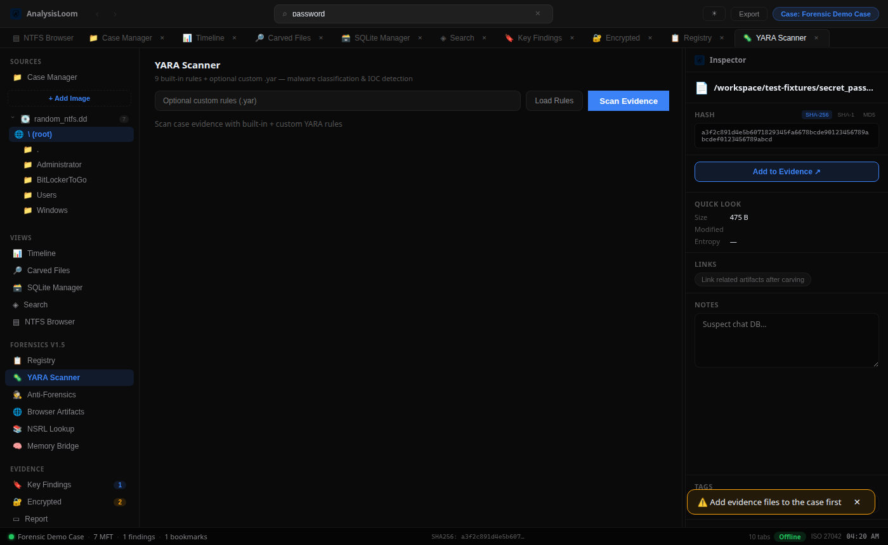 |

**How to use:** Open **YARA Scanner** → add paths or select from case evidence → **Scan Evidence**.

### Anti-Forensics Detection
Detect timestomping, NTFS alternate data streams, and extension mismatches from MFT records or file paths.

| |
|:--:|
| 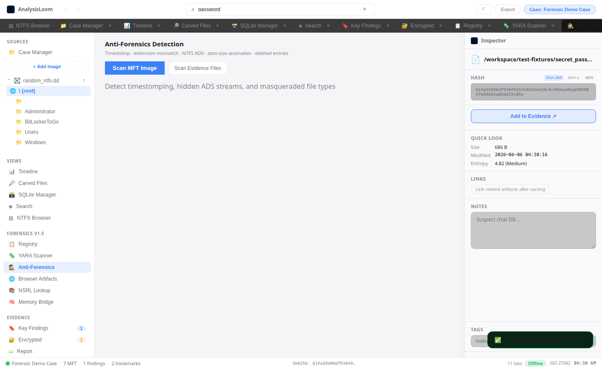 |

**How to use:** Load a disk image → open **Anti-Forensics** → **Scan MFT Image**.

### Browser Artifacts
Extract browsing history, downloads, and related SQLite artifacts from Chrome, Firefox, Safari, and Edge profiles.

| |
|:--:|
| 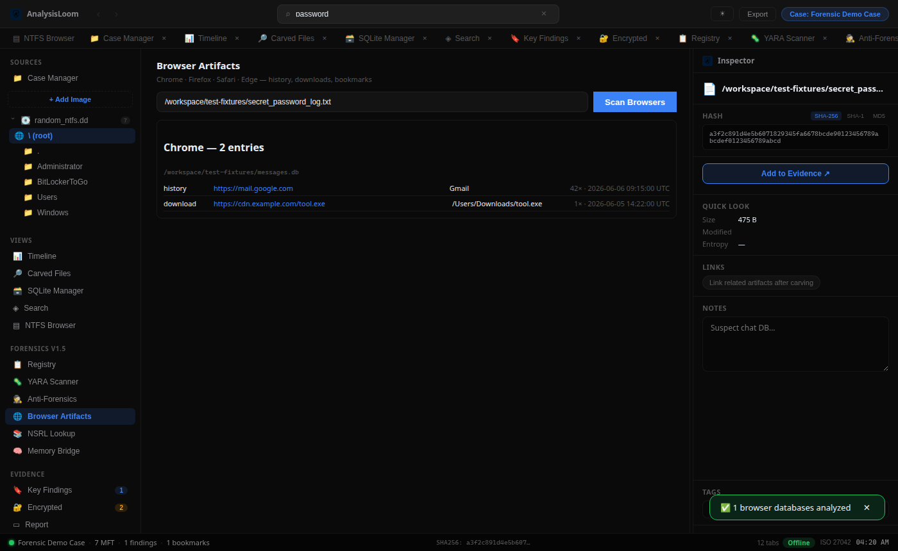 |

**How to use:** Open **Browser Artifacts** → **Scan Browsers** or point to a specific `History` / `places.sqlite` database.

### NSRL Lookup
Check file hashes against the NIST NSRL known-good database. Import custom NSRL sets or use the built-in seed.

| |
|:--:|
| 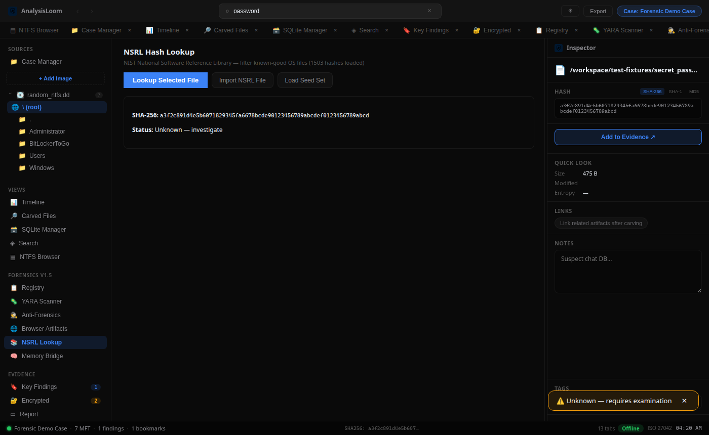 |

**How to use:** Select a file in the NTFS browser → open **NSRL Lookup** → **Lookup Selected File**.

### Memory Bridge
Import Volatility 3 JSON output and browse processes, network connections, and plugin metadata without leaving the case.

| |
|:--:|
| 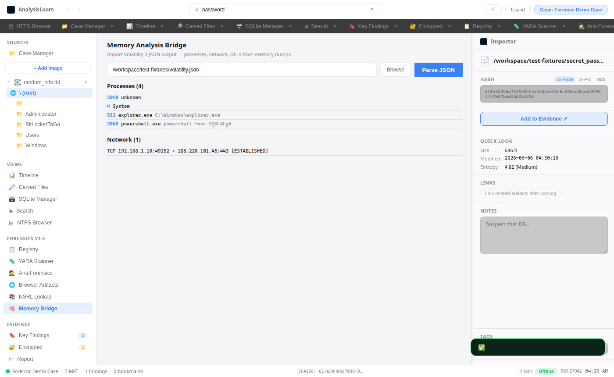 |

**How to use:** Open **Memory Bridge** → paste or browse to a Volatility JSON export → **Parse JSON**.

### Report
Generate HTML or PDF case reports including evidence list, findings, and audit trail.

| |
|:--:|
| 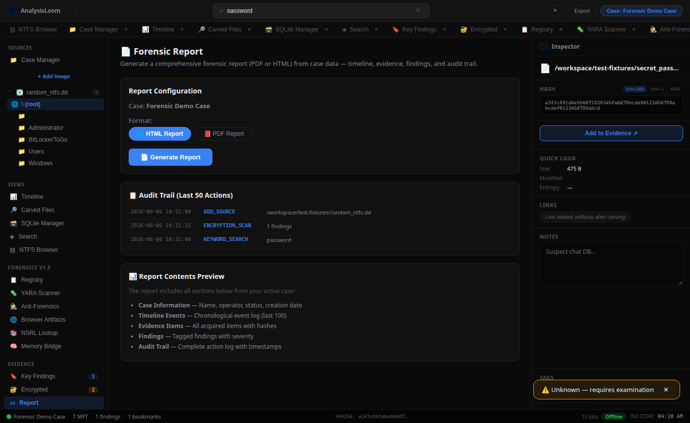 |

### About
Application info, feature list, and chain-of-custody disclaimer.

| |
|:--:|
| 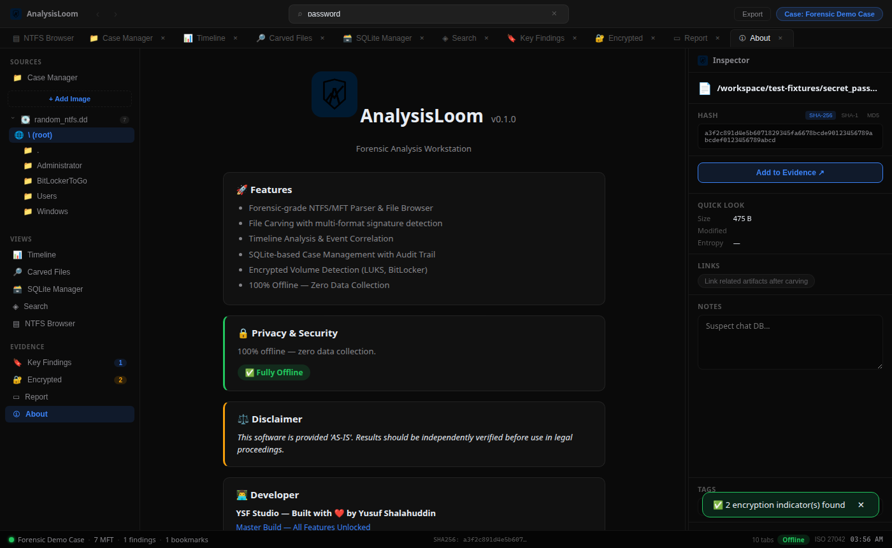 |

## 🚀 Quick Start

**Prerequisites:** Node.js 20+, Rust stable (1.85+), and Linux build deps:

```bash
# Linux (Ubuntu/Debian)
sudo apt-get install -y libwebkit2gtk-4.1-dev libappindicator3-dev librsvg2-dev \
  patchelf libssl-dev build-essential pkg-config
```

```bash
git clone https://github.com/YSF-Studio/analysisloom.git
cd analysisloom
npm install
npm run dev:analysisloom
```

Or download a pre-built binary from [Releases](https://github.com/YSF-Studio/analysisloom/releases).

### Try with sample fixtures

Generate synthetic forensic test files and load them in the app:

```bash
npm run test:fixtures
npm run dev:analysisloom
```

| Fixture | Use in app |
|---------|------------|
| `test-fixtures/random_ntfs.dd` | Sources → **Add Image** |
| `test-fixtures/messages.db` | **Open Artifact** or SQLite Manager |
| `test-fixtures/secret_password_log.txt` | **Open Artifact** → Inspector → Add to Evidence |
| `test-fixtures/carve_source.dd` | Add Image → **Carved Files** → Start Carving |
| `test-fixtures/luks_volume.dd` | Add Image → **Encrypted** → Scan |

## 📖 Feature Guide

### 1. Start a case
1. Click **Case** in the titlebar (or **Case Manager** in the sidebar).
2. Enter case name and operator → **+ New Case**.
3. The active case is shown in the titlebar pill.

### 2. Load disk evidence
1. In **SOURCES**, click **Add Image**.
2. Select a raw disk image (`.dd`, `.raw`, `.img`).
3. The MFT is parsed locally; the folder tree appears under the image name.
4. Click folders to filter the file list; click files to inspect.

### 3. Inspect & hash files
1. Select a file in the NTFS browser, or use **Open Artifact** in the Inspector.
2. SHA-256, SHA-1, and MD5 are computed by the Rust backend.
3. Add tags/notes → **Add to Evidence** to record chain of custody.

### 4. SQLite analysis
1. Open a `.db` / `.sqlite` file via **Open Artifact**, or select `messages.db` from NTFS.
2. Switch to **SQLite Manager** tab.
3. Browse tables, view columns, paginate rows, or run custom `SELECT` queries.

### 5. File carving
1. Ensure a disk image is loaded in Sources.
2. Open **Carved Files** → choose output folder → **Start Carving**.
3. Progress appears in the status bar; results list recovered file offsets and types.

### 6. Encryption detection
1. Load a disk image.
2. Open **Encrypted** → **Scan for Encryption**.
3. Review LUKS / BitLocker / high-entropy findings with confidence scores.

### 7. Search & bookmarks
1. Type a keyword in the titlebar search → Enter (opens **Search** view).
2. In **Key Findings**, add bookmarks with tags (`suspicious`, `malware`, etc.) and notes.

### 8. Export report
1. Open **Report** with an active case.
2. Choose **HTML** or **PDF** format → **Generate Report**.
3. Report includes evidence, findings, timeline summary, and audit log.

## 🧪 Testing

```bash
npm run test:full          # fixtures + unit + integration + build + GUI smoke
npm run test:integration   # all Tauri commands against random fixtures
npm run test:fixtures      # export fixtures to test-fixtures/
npm run test:gui           # validate production bundle strings
```

### Regenerate screenshots (maintainers)

Screenshots are captured in **light theme** with the **real Rust backend** processing files from `test-fixtures/` (disk image, SQLite, browser History, registry hive, Volatility JSON).

```bash
bash scripts/capture-screenshots.sh
```

## 🔒 Security & DevSecOps

- **Offline-first:** no telemetry; all forensic processing runs locally
- **CI gates:** `cargo fmt`, `clippy -D warnings`, `cargo test`, gitleaks, CodeQL, `cargo audit`
- **Dependency updates:** Dependabot weekly for Cargo, npm, and GitHub Actions
- **Release:** tagged builds with CycloneDX SBOM and provenance attestation
- **Reporting vulnerabilities:** see [SECURITY.md](SECURITY.md)

```bash
npm run fmt:check && npm run lint && npm run test:all
npm run audit:rust && npm run audit:npm
```

### Creating a release

```bash
git tag v0.1.0 && git push origin v0.1.0
```

## 🏗️ Tech Stack

| Layer | Technology |
|-------|------------|
| Shell | Tauri v2 (Rust) |
| UI | SvelteKit 5, macOS-inspired three-pane layout |
| Forensic engine | Inline Rust — NTFS/MFT, carving, hashing, SQLite, encryption, PDF/HTML reports |
| Storage | SQLite (cases, evidence, timeline, audit, bookmarks) |
| Security | Strict CSP, minimal Tauri capabilities, offline-only |

## 📁 Project Structure

```
packages/analysisloom/
  src/App.svelte              # Main shell (sidebar, tabs, inspector)
  src/lib/components/         # Feature tabs (NTFS, SQLite, Carving, …)
  src/lib/viewRegistry.js     # Tab & navigation metadata
  src-tauri/src/forensic/     # Rust forensic engines
  src-tauri/src/commands.rs   # Tauri IPC commands
scripts/
  run-full-test.sh            # Full test suite
  capture-screenshots.sh      # Headless screenshot capture
  generate-test-fixtures.sh   # Random fixture generator
test-fixtures/                # Generated sample files (gitignored)
screenshots/                  # README screenshots
```

## 📄 License

MIT — see [LICENSE](LICENSE).
